# DrinkPartyRoulette
 - このアプリは、イベントの座席をランダムに割り当てる抽選アプリです。
- 会社向けのイントラ用アプリです

[▶️ 動画を見る](videos/sample.mp4)

アイコン


---

## アプリ画面

- 起動時

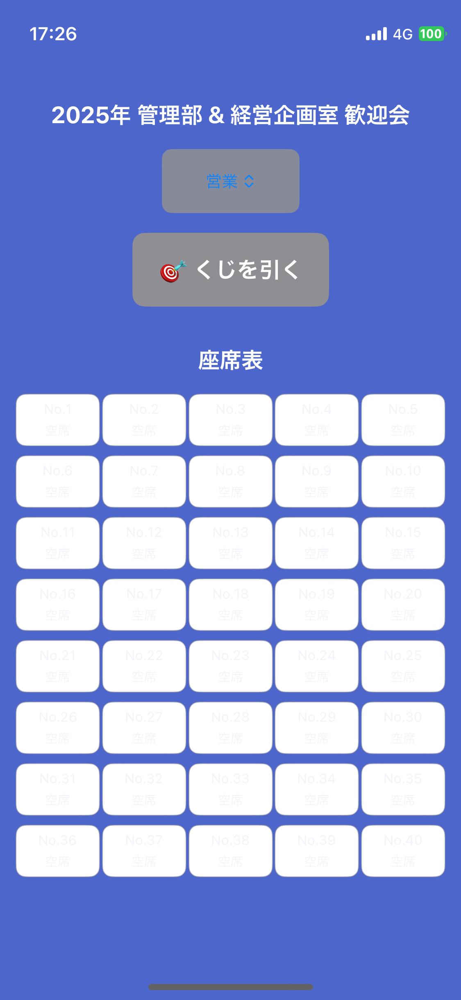

- 部署・氏名を選択

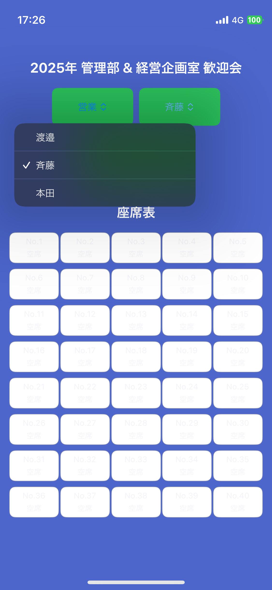

- くじボタン

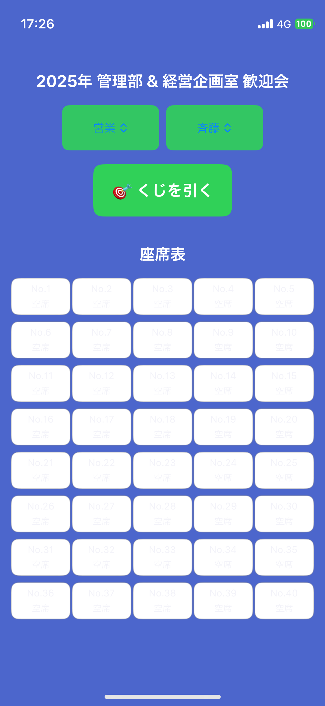

- くじ抽選演出

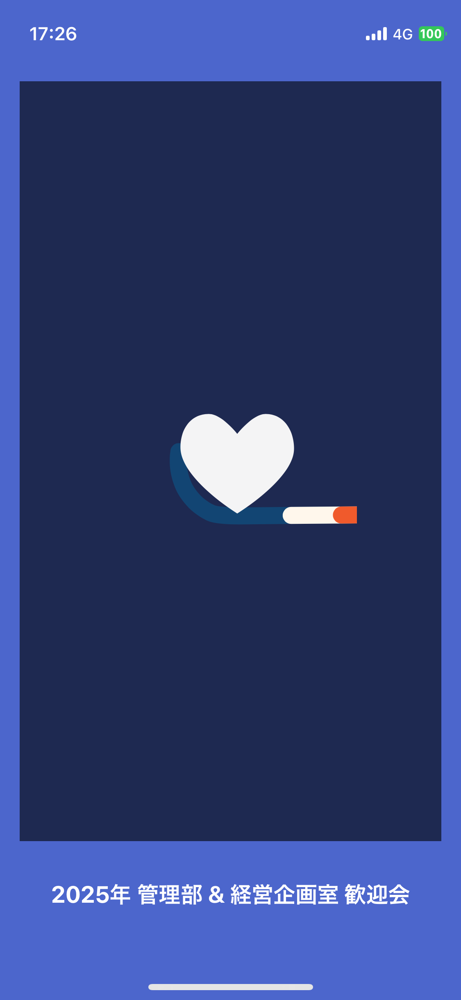

- くじ結果 (直近のくじ引き結果は背景<font color="#ff4500">赤色</font>で表示)

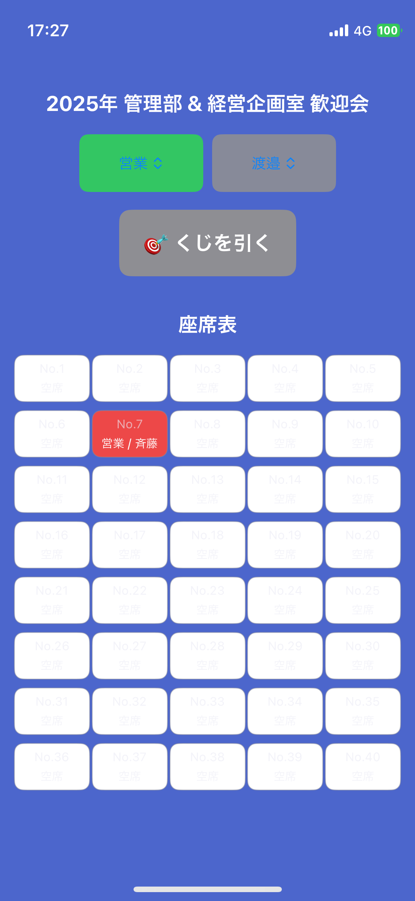

- くじ結果 (前回までの結果は背景<font color="#00ff7f">緑色</font>で表示)

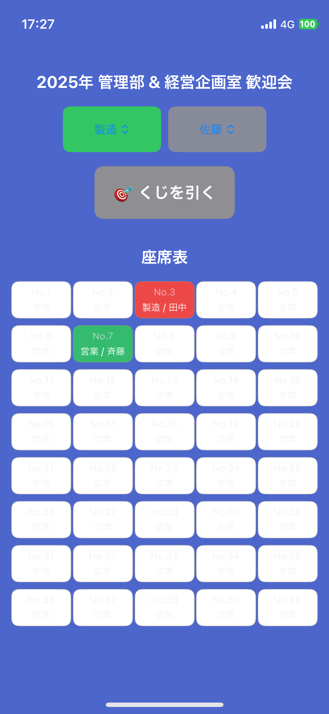

- くじ結果

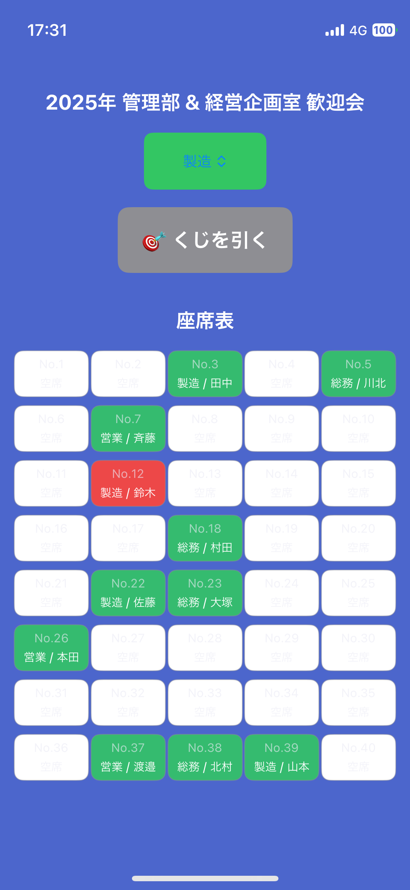

---

## 主な機能

- 部署・氏名を選んでくじを引くと座席を自動割り当て
- アニメーション付きの演出で楽しく！
- 重複なしで全員が1席ずつ割り当てられる
- 座席表は自動的に更新・表示

---

## 開発環境

| 項目             | 内容             |
|------------------|------------------|
| 開発言語         | Swift            |
| フレームワーク   | SwiftUI          |
| Xcode バージョン | Xcode 15.3 以上  |
| 対応 iOS         | iOS 16.0 以上    |
| ライブラリ       | [Lottie](https://github.com/airbnb/lottie-ios) |

---

## 更新履歴

|日付|ブランチ|詳細|
|:--|:--|:--|
|2025/04/17|main|リリース|

---

## インストール方法
Swift Package Managerを使用して Lottie をインストールする

> ライブラリ掲載先 : [github.com/airbnb/lottie-io](https://github.com/airbnb/lottie-ios)  
> 参考サイト : [初心者のためのLottie&LottieFiles](https://note.com/by_yuheisasaki/n/n7cd838c712f0)


1. `Xcode` → `File` → `Add Package Dependencies` を選択します。
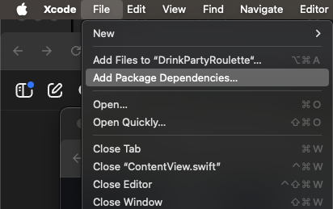


2. `Search All Sources` の右の **①検索ボックス** で
    ```bash
    https://github.com/airbnb/lottie-spm.git
    ```
    へアクセスし、`lottie-spm` を追加 (**②Add Package**)

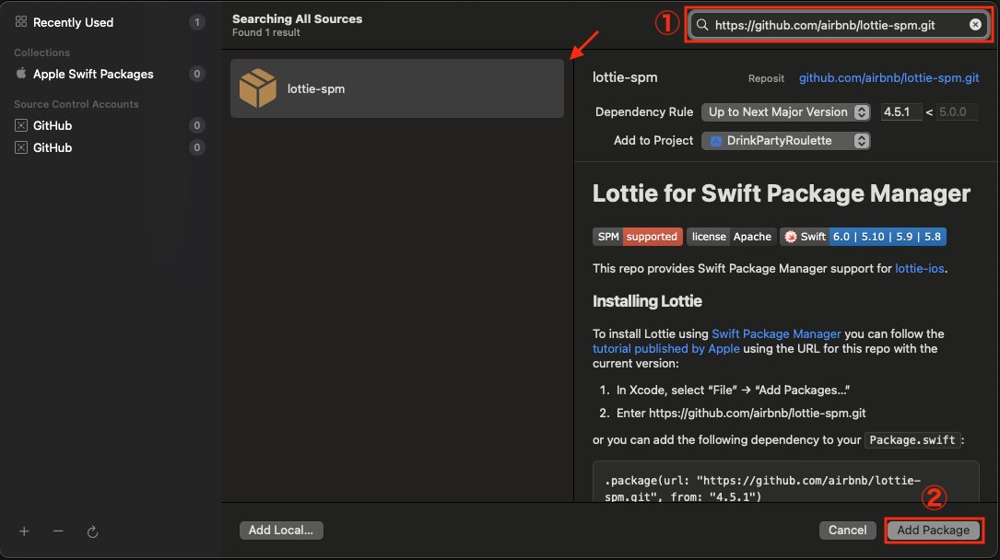

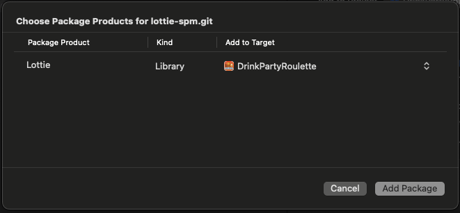

---

3. `ContentView.swift` などを Xcode でビルド

---

## ディレクトリ構成

```bash
:
├── DrinkPartyRoulette
│   ├── DrinkPartyRouletteApp.swift # App エントリーポイント
│   ├── ContentView.swift # App 画面構成
│   ├── Member.swift # JSONデータ読込用の構造体
│   ├── SeatManager.swift # 座席の空き状況や、JSONからの名簿読み込みなどを扱う状態管理クラス
│   ├── Seat.swift # 座席管理用のデータモデル
│   ├── members.json # 名簿ファイル
│   ├── anime_01.json # アニメーションファイル
│   └── Assets.xcassets
└── README.md
```


### 名簿ファイル(members.json)の作成・編集
 - id : Index 番号
 - name : 氏名
 - department : 所属

```json
[
    { "id": 1, "name": "サトウ", "department": "製造" },
    { "id": 2, "name": "ヤマモト", "department": "製造" },
    { "id": 3, "name": "タナカ", "department": "製造" },
    { "id": 4, "name": "スズキ", "department": "製造" },
    { "id": 5, "name": "ホンダ", "department": "製造" },
    { "id": 6, "name": "タナカ", "department": "営業" },
    { "id": 8, "name": "ワタナベ", "department": "営業" },
    { "id": 9, "name": "キタムラ", "department": "営業" }
]
```

---

### アニメーションファイル(anime_01.json)の入手
- [LottieFiles](https://lottiefiles.com/featured-free-animations?page=183) でアカウントを作成し、ログインした画面右下の **Free community animations** → **View more** より無料配布のものを入手する。

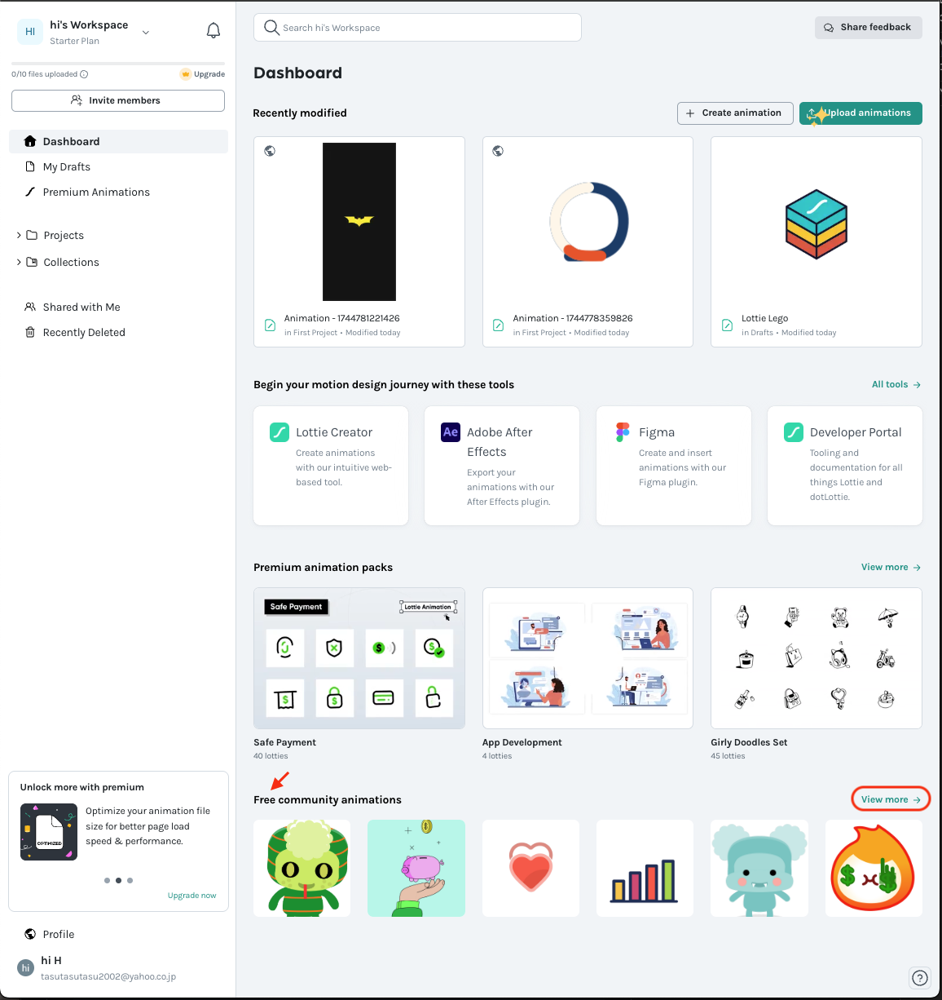

- **Lottie JSON** を選択して適当にリネームし保存する。
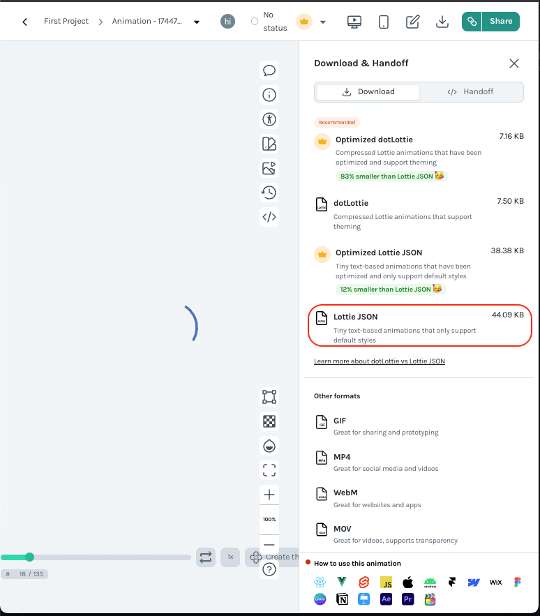

---

## ライセンス
このプロジェクトは [MITライセンス](LICENSE) のもとで公開されています。

---

## クレジット・協力
アニメーション: [LottieFiles](https://lottiefiles.com)

---

## お問い合わせ

不具合報告・提案などは Issues または Pull Request にてお願いします。

---

